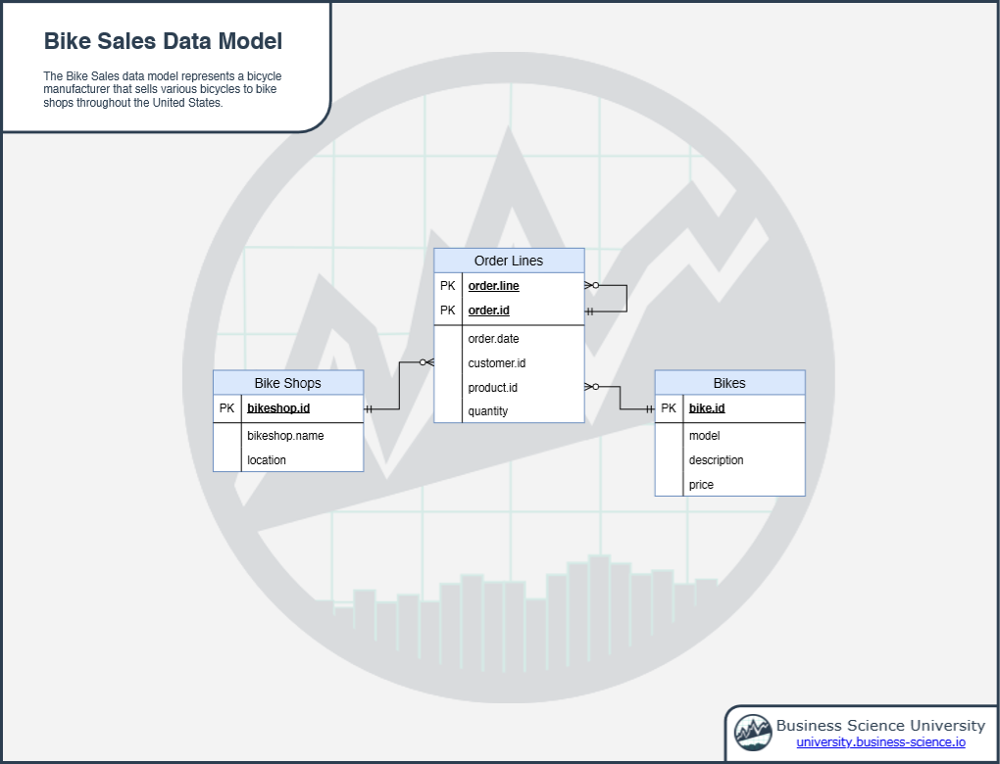

```{r setup, include=FALSE}
knitr::opts_chunk$set(echo = TRUE)
```

The __Bike Sales Database__ represents a __bicycle manufacturer__, including tables for products (bikes), customers (bike shops), and transactions (orders).

## Data Model

```{r, echo=F}

```


## About

The Bike Sales data files consist of 3 excel spreadsheets that represent: 

- `bikes` table which includes bicycle models, descriptions, and unit prices that are produced by the manufacturer.

- `bikeshops` table which includes customers that the bicycle manufacturer has sold to.

- `orderlines` table which includes transactional data such as order ID, order line, date, customer, product, and quantity sold.

## Tables

```{r, message=F}
library(tidyverse)
library(readxl)
library(fs)

dir_info("./data_raw") %>%
    filter(str_detect(path, "xlsx")) %>%
    pull(path) %>%
    map(read_xlsx) %>%
    set_names(c("bikes", "bikeshops", "orderlines"))
```

