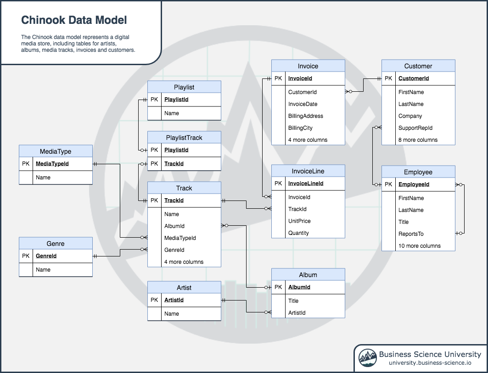

Chinook SQLite Database
================

The [Chinook SQLite
Database](https://github.com/lerocha/chinook-database) represents a
**digital media store**, including tables for artists, albums, media
tracks, invoices and customers.

## Data Model

<!-- -->

## About

The Chinook database consists of 11 tables that represent

  - `Employee` table stores employees data such as employee id, last
    name, first name, etc. It also has a field named `ReportsTo` to
    specify who reports to whom.

  - `Customer` table stores customers data.

  - `Invoice` & `InvoiceLine` tables: these two tables store invoice
    data. The `Invoice` table stores invoice header data and the
    `InvoiceLine` table stores the invoice line items data.

  - `Artist` table stores artists data. It is a simple table that
    contains only artist id and name.

  - `Album` table stores data about a list of tracks. Each album belongs
    to one artist. However, one artist may have multiple albums.

  - `MediaType` table stores media types such as MPEG audio file, ACC
    audio file, etc.

  - `Genre` table stores music types such as rock, jazz, metal, etc.

  - `Track` table store the data of songs. Each track belongs to one
    album.

  - `Playlist` & `PlaylistTrack` tables: `Playlist` table store data
    about playlists. Each playlist contains a list of tracks. Each track
    may belong to multiple playlists. The relationship between the
    `Playlist` table and `Track` table is many-to-many. The
    `PlaylistTrack` table is used to reflect this relationship.

## Tables

``` r
library(odbc)
library(tidyverse)

con <- dbConnect(RSQLite::SQLite(), "Chinook_Sqlite.sqlite")

tbl_chr <- dbListTables(con)

table_list <- tbl_chr %>%
    map(~ tbl(con, .) %>% collect()) %>%
    set_names(tbl_chr)

table_list
```

    ## $Album
    ## # A tibble: 347 x 3
    ##    AlbumId Title                                 ArtistId
    ##      <int> <chr>                                    <int>
    ##  1       1 For Those About To Rock We Salute You        1
    ##  2       2 Balls to the Wall                            2
    ##  3       3 Restless and Wild                            2
    ##  4       4 Let There Be Rock                            1
    ##  5       5 Big Ones                                     3
    ##  6       6 Jagged Little Pill                           4
    ##  7       7 Facelift                                     5
    ##  8       8 Warner 25 Anos                               6
    ##  9       9 Plays Metallica By Four Cellos               7
    ## 10      10 Audioslave                                   8
    ## # ... with 337 more rows
    ## 
    ## $Artist
    ## # A tibble: 275 x 2
    ##    ArtistId Name                
    ##       <int> <chr>               
    ##  1        1 AC/DC               
    ##  2        2 Accept              
    ##  3        3 Aerosmith           
    ##  4        4 Alanis Morissette   
    ##  5        5 Alice In Chains     
    ##  6        6 Antônio Carlos Jobim
    ##  7        7 Apocalyptica        
    ##  8        8 Audioslave          
    ##  9        9 BackBeat            
    ## 10       10 Billy Cobham        
    ## # ... with 265 more rows
    ## 
    ## $Customer
    ## # A tibble: 59 x 13
    ##    CustomerId FirstName LastName Company Address City  State Country
    ##         <int> <chr>     <chr>    <chr>   <chr>   <chr> <chr> <chr>  
    ##  1          1 Luís      Gonçalv… Embrae… Av. Br… São … SP    Brazil 
    ##  2          2 Leonie    Köhler   <NA>    Theodo… Stut… <NA>  Germany
    ##  3          3 François  Tremblay <NA>    1498 r… Mont… QC    Canada 
    ##  4          4 Bjørn     Hansen   <NA>    Ullevå… Oslo  <NA>  Norway 
    ##  5          5 František Wichter… JetBra… Klanov… Prag… <NA>  Czech …
    ##  6          6 Helena    Holý     <NA>    Rilská… Prag… <NA>  Czech …
    ##  7          7 Astrid    Gruber   <NA>    Rotent… Vien… <NA>  Austria
    ##  8          8 Daan      Peeters  <NA>    Grétry… Brus… <NA>  Belgium
    ##  9          9 Kara      Nielsen  <NA>    Sønder… Cope… <NA>  Denmark
    ## 10         10 Eduardo   Martins  Woodst… Rua Dr… São … SP    Brazil 
    ## # ... with 49 more rows, and 5 more variables: PostalCode <chr>,
    ## #   Phone <chr>, Fax <chr>, Email <chr>, SupportRepId <int>
    ## 
    ## $Employee
    ## # A tibble: 8 x 15
    ##   EmployeeId LastName FirstName Title ReportsTo BirthDate HireDate Address
    ##        <int> <chr>    <chr>     <chr>     <int> <chr>     <chr>    <chr>  
    ## 1          1 Adams    Andrew    Gene…        NA 1962-02-… 2002-08… 11120 …
    ## 2          2 Edwards  Nancy     Sale…         1 1958-12-… 2002-05… 825 8 …
    ## 3          3 Peacock  Jane      Sale…         2 1973-08-… 2002-04… 1111 6…
    ## 4          4 Park     Margaret  Sale…         2 1947-09-… 2003-05… 683 10…
    ## 5          5 Johnson  Steve     Sale…         2 1965-03-… 2003-10… 7727B …
    ## 6          6 Mitchell Michael   IT M…         1 1973-07-… 2003-10… 5827 B…
    ## 7          7 King     Robert    IT S…         6 1970-05-… 2004-01… 590 Co…
    ## 8          8 Callahan Laura     IT S…         6 1968-01-… 2004-03… 923 7 …
    ## # ... with 7 more variables: City <chr>, State <chr>, Country <chr>,
    ## #   PostalCode <chr>, Phone <chr>, Fax <chr>, Email <chr>
    ## 
    ## $Genre
    ## # A tibble: 25 x 2
    ##    GenreId Name              
    ##      <int> <chr>             
    ##  1       1 Rock              
    ##  2       2 Jazz              
    ##  3       3 Metal             
    ##  4       4 Alternative & Punk
    ##  5       5 Rock And Roll     
    ##  6       6 Blues             
    ##  7       7 Latin             
    ##  8       8 Reggae            
    ##  9       9 Pop               
    ## 10      10 Soundtrack        
    ## # ... with 15 more rows
    ## 
    ## $Invoice
    ## # A tibble: 412 x 9
    ##    InvoiceId CustomerId InvoiceDate BillingAddress BillingCity BillingState
    ##        <int>      <int> <chr>       <chr>          <chr>       <chr>       
    ##  1         1          2 2009-01-01… Theodor-Heuss… Stuttgart   <NA>        
    ##  2         2          4 2009-01-02… Ullevålsveien… Oslo        <NA>        
    ##  3         3          8 2009-01-03… Grétrystraat … Brussels    <NA>        
    ##  4         4         14 2009-01-06… 8210 111 ST NW Edmonton    AB          
    ##  5         5         23 2009-01-11… 69 Salem Stre… Boston      MA          
    ##  6         6         37 2009-01-19… Berger Straße… Frankfurt   <NA>        
    ##  7         7         38 2009-02-01… Barbarossastr… Berlin      <NA>        
    ##  8         8         40 2009-02-01… 8, Rue Hanovre Paris       <NA>        
    ##  9         9         42 2009-02-02… 9, Place Loui… Bordeaux    <NA>        
    ## 10        10         46 2009-02-03… 3 Chatham Str… Dublin      Dublin      
    ## # ... with 402 more rows, and 3 more variables: BillingCountry <chr>,
    ## #   BillingPostalCode <chr>, Total <dbl>
    ## 
    ## $InvoiceLine
    ## # A tibble: 2,240 x 5
    ##    InvoiceLineId InvoiceId TrackId UnitPrice Quantity
    ##            <int>     <int>   <int>     <dbl>    <int>
    ##  1             1         1       2      0.99        1
    ##  2             2         1       4      0.99        1
    ##  3             3         2       6      0.99        1
    ##  4             4         2       8      0.99        1
    ##  5             5         2      10      0.99        1
    ##  6             6         2      12      0.99        1
    ##  7             7         3      16      0.99        1
    ##  8             8         3      20      0.99        1
    ##  9             9         3      24      0.99        1
    ## 10            10         3      28      0.99        1
    ## # ... with 2,230 more rows
    ## 
    ## $MediaType
    ## # A tibble: 5 x 2
    ##   MediaTypeId Name                       
    ##         <int> <chr>                      
    ## 1           1 MPEG audio file            
    ## 2           2 Protected AAC audio file   
    ## 3           3 Protected MPEG-4 video file
    ## 4           4 Purchased AAC audio file   
    ## 5           5 AAC audio file             
    ## 
    ## $Playlist
    ## # A tibble: 18 x 2
    ##    PlaylistId Name                      
    ##         <int> <chr>                     
    ##  1          1 Music                     
    ##  2          2 Movies                    
    ##  3          3 TV Shows                  
    ##  4          4 Audiobooks                
    ##  5          5 90’s Music                
    ##  6          6 Audiobooks                
    ##  7          7 Movies                    
    ##  8          8 Music                     
    ##  9          9 Music Videos              
    ## 10         10 TV Shows                  
    ## 11         11 Brazilian Music           
    ## 12         12 Classical                 
    ## 13         13 Classical 101 - Deep Cuts 
    ## 14         14 Classical 101 - Next Steps
    ## 15         15 Classical 101 - The Basics
    ## 16         16 Grunge                    
    ## 17         17 Heavy Metal Classic       
    ## 18         18 On-The-Go 1               
    ## 
    ## $PlaylistTrack
    ## # A tibble: 8,715 x 2
    ##    PlaylistId TrackId
    ##         <int>   <int>
    ##  1          1    3402
    ##  2          1    3389
    ##  3          1    3390
    ##  4          1    3391
    ##  5          1    3392
    ##  6          1    3393
    ##  7          1    3394
    ##  8          1    3395
    ##  9          1    3396
    ## 10          1    3397
    ## # ... with 8,705 more rows
    ## 
    ## $Track
    ## # A tibble: 3,503 x 9
    ##    TrackId Name  AlbumId MediaTypeId GenreId Composer Milliseconds  Bytes
    ##      <int> <chr>   <int>       <int>   <int> <chr>           <int>  <int>
    ##  1       1 For …       1           1       1 Angus Y…       343719 1.12e7
    ##  2       2 Ball…       2           2       1 <NA>           342562 5.51e6
    ##  3       3 Fast…       3           2       1 F. Balt…       230619 3.99e6
    ##  4       4 Rest…       3           2       1 F. Balt…       252051 4.33e6
    ##  5       5 Prin…       3           2       1 Deaffy …       375418 6.29e6
    ##  6       6 Put …       1           1       1 Angus Y…       205662 6.71e6
    ##  7       7 Let'…       1           1       1 Angus Y…       233926 7.64e6
    ##  8       8 Inje…       1           1       1 Angus Y…       210834 6.85e6
    ##  9       9 Snow…       1           1       1 Angus Y…       203102 6.60e6
    ## 10      10 Evil…       1           1       1 Angus Y…       263497 8.61e6
    ## # ... with 3,493 more rows, and 1 more variable: UnitPrice <dbl>
